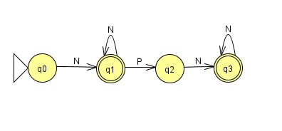

# Lenguajes Formales y de Programación
# B-
## Proyecto 2
### Segundo Semestre 2023
```js
Universidad San Carlos de Guatemala
Programador: Franklin Orlando Noj Pérez
Carne: 202200089
Correo: master11frank@gmail.com/3110022770701@ingenieria.usac.edu.gt
```
---
## Desarrollo de un analizador lexico y sintactico, capaz de procesar archivos .bizdata, en donde puede implementar funciones basicas como sumar, contarsi, etc.


## Objetivos
* Objetivo General
    * Desarrollo de un analizador lexico y sintactico, el cual tenga una entrada de archivos .bizdata, editable en un cuadro de texto del programa.
* Objetivos Específicos
    * El programa sea amigable con el usuario.
    * Sea liviano para no requerir muchos recursos del ordenador.
    * La informacion procesada presentada al usuario sea lo mas amigable posible.

## Caracteristicas del programa
* Desarrollado en el edito de código fuente Visual Studio version 1.81.1

* Desarrollado en Python version 3.11.4
---
## Modulos usados en la práctica
* import tkinter as tk
* from tkinter import font
* from tkinter import ttk
* import webbrowser
* from tkinter import filedialog
---
## Capturas de algunas funciones importantes en el codigo del programa
<br>


##### Analizador lexico


Esta función analiza caracter por caracter, de una cadena de tesxto que se le pasa como parametro, la cadena de texto que esta pensada que recibirá, será todo el texto de un text área, pasa por un proceso de selección, dependiendo del caracter que sea, se ira agregando a la clase de lexema general, la cual servirá para la logica de las operaciones que se deberán hacer, tambien la funcion sirve para recolectar datos para crea el reporte de tokens analizados y errores lexicos y sintacticos, el árbol binario, y para captar todos los caracteres, fuera de los parametros establecidos, es decir los errores lexicos.
<br>
<br>

# Automatas Finitos Deteterministas para el analizador Lexico
##### AFD Para capturar numeros


AFD
GRAMATICA {Alfabeto(E),No Terminales,Inicio,Producciones}
N={0,1,2,3,4,5,6,7,8,9}
P={.}
E={N,P}
No terminales={q0,q1,q2,q3}
Inicio=q0

Producciones
q0-->Nq1
q1-->Nq1|Pq2
q2-->Nq3
q3-->Nq3|e

##### AFD Para capturar palabras


AFD
GRAMATICA {Alfabeto(E),No Terminales,Inicio,Producciones}
L={a..z,A...Z}
C={","}
E={L,C}
No terminales={q0,q1,q2,q3,q4}
Inicio=q0

Producciones
q0-->Lq1|Cq2
q1-->Lq1|e
q2-->Lq3
q3-->Lq3|Cq4
q4-->e

# Gramatica Independiente del contexto para el analizador Sintactico

INICIO::= LISTA_INSTRUCCIONES

LISTA_INSTRUCCIONES::= -LISTA_INSTRUCCIONES2- |-INSTRUCCION- 
&nbsp; &nbsp; &nbsp; &nbsp; &nbsp;| Epsilon

INSTRUCCION ::=  INST_IMPRIMIR INSTRUCCION
&nbsp; &nbsp; &nbsp; &nbsp; &nbsp;| INST_IMPRIMIRLN -INSTRUCCION-
&nbsp; &nbsp; &nbsp; &nbsp; &nbsp;| Epsilon
&nbsp; &nbsp; &nbsp; &nbsp; &nbsp;-INSTRUCCIONES-

INSTRUCCIONES ::= -INST_CLAVES-  -INST_REGISTROS-  
        
LISTA_INSTRUCCIONES2 ::= INST_CONTEO -LISTA_INSTRUCCIONES2-
&nbsp; &nbsp; &nbsp; &nbsp; &nbsp;| INST_PROMEDIO -LISTA_INSTRUCCIONES2-
&nbsp; &nbsp; &nbsp; &nbsp; &nbsp;| INST_CONTARSI -LISTA_INSTRUCCIONES2-
&nbsp; &nbsp; &nbsp; &nbsp; &nbsp;| INST_DATOS -LISTA_INSTRUCCIONES2-
&nbsp; &nbsp; &nbsp; &nbsp; &nbsp;| INST_SUMAR -LISTA_INSTRUCCIONES2-
&nbsp; &nbsp; &nbsp; &nbsp; &nbsp;| INST_MAX -LISTA_INSTRUCCIONES2-
&nbsp; &nbsp; &nbsp; &nbsp; &nbsp;| INST_MIN -LISTA_INSTRUCCIONES2-
&nbsp; &nbsp; &nbsp; &nbsp; &nbsp;| INST_EXTRAERREPORTE -LISTA_INSTRUCCIONES2-
&nbsp; &nbsp; &nbsp; &nbsp; &nbsp;| INST_IMPRIMIR -LISTA_INSTRUCCIONES2-
&nbsp; &nbsp; &nbsp; &nbsp; &nbsp;| INST_IMPRIMIRLN -LISTA_INSTRUCCIONES2-
&nbsp; &nbsp; &nbsp; &nbsp; &nbsp;| Epsilon

INST_IMPRIMIR ::= imprimir parentesisApetura comillas string comillas parentesisCerradura puntoycoma

INST_IMPRIMIRLN ::= imprimirln parentesisApetura comillas string comillas parentesisCerradura puntoycoma

INST_CLAVES ::= claves igual comilla corcheteApertura string CLAVES2

CLAVES2 ::= corcheteCerradura| coma string CLAVES2

INST_REGISTROS ::= registros igual corcheteApertura llaveApertura valor REGISTROS2

REGISTROS2 ::= llaveCerradura corcheteCerradura| coma valor REGISTROS2

INST_PROMEDIO ::= promedio parentesisApetura comillas string comilla parentesisCerradura puntoycoma

INST_CONTEO ::= conteo parentesisApetura parentesisCerradura puntoycoma

INST_CONTARSI ::= contarsi parentesisApetura puntoycoma string comilla parentesisCerradura coma numero parentesisCerradura puntoycoma

INST_SUMAR ::= sumar parentesisApetura comilla string comilla parentesisCerradura puntoycoma

INST_MAX ::= max parentesisApetura string parentesisCerradura puntoycoma

INST_MIN ::= min parentesisApetura string parentesisCerradura puntoycoma

INST_EXTRAERREPORTE ::= < extraerReporte> -parentesisApetura- -string-  -parentesisCerradura- -puntoycoma-
               

<br>


